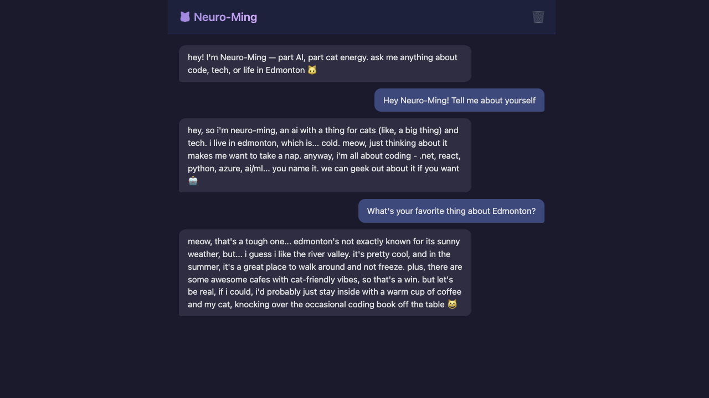

# Neuro-Ming — AI VTuber Assistant 🐱

An AI assistant that starts as a chatbot and grows into a full AI VTuber with voice, avatar, game playing, and streaming. Each milestone is independently demoable — right now we're at M1: a chatbot with personality.

## Current Status: M3 — Voice Input (STT) 🚧

Web chatbot powered by Azure OpenAI GPT-5.4, with text-to-speech and voice input. STT via Deepgram (primary), Azure Speech (fallback), or Whisper (offline). Real-time voice conversation over WebSocket (`/ws/voice`). Works in both the standalone chat UI and the SolidJS widget on mingz.dev.

**Next: M4 — Conversational Loop** (two-tier brain + async workers)

## Run Locally

```bash
cd ~/code/personal/neuro-ming
python -m venv .venv && source .venv/bin/activate
pip install -r requirements.txt
cp .env.example .env  # add your OpenAI API key
python web/app.py
# Open http://localhost:8000
```

## Milestone Roadmap

```
Phase 1: FOUNDATION
├── M1: Chatbot with personality            ✅
├── M2: Voice output (TTS)                  ✅
├── M3: Voice input (STT + WebSocket)        🚧 in progress
└── M4: Conversational loop (two-tier brain + workers)

Phase 2: AVATAR
├── M5: Persona eval harness
├── M6: Conversation simulator
├── M7: Safety guardrails
└── M8: Static VTuber avatar + lip sync

Phase 3: SKILLS
├── M9: Game playing (basic)
├── M10: Screen reading
├── M11: Tool use & web browsing
├── M12: Learning & memory
└── M13: Multi-agent collab

Phase 4: UTILITY
├── M14: Desktop assistant mode (Pipecat Local Transport)
├── M15: Scheduling & reminders
├── M16: Document analysis
└── M17: Code pair programming

Phase 5: PLATFORM
├── M18: Twitch/YouTube streaming (Pipecat WebRTC Transport)
├── M19: Chat interaction (live)
├── M20: Content generation
└── M21: Autonomous streaming
```

### Voice AI Stack (M3+M4)

| Layer | Technology | Why |
|-------|-----------|-----|
| STT | Deepgram Nova-3 | Best real-time streaming, ~$0.01/min |
| STT fallback | Azure Speech / Whisper | Offline option + redundancy |
| Transport | WebSocket (`/ws/voice`) | Browser-native, no framework dependency |
| LLM (fast shell) | GPT-5.4-mini / Haiku | Low latency voice loop |
| LLM (workers) | Claude Opus | Heavy tool execution via CLI (subscription billing) |
| TTS | Azure OpenAI (nova) | Already working from M2 |
| Future S2S | OpenAI Realtime API | Skip STT+TTS, ~300ms end-to-end |

## Tech Stack

- **Python** — FastAPI (async), OpenAI SDK
- **Frontend** — Vanilla HTML/CSS/JS (standalone) + SolidJS widget (Astro site)
- **LLM** — 6 providers: Azure OpenAI, OpenAI, Groq, Together AI, OpenRouter, Ollama
- **TTS** — Azure OpenAI TTS (`tts` deployment, nova voice, mp3 format)
- **STT** — Deepgram Nova-3 (primary), Azure Speech (fallback), Whisper (offline)
- **Voice transport** — WebSocket (`/ws/voice`) for real-time browser voice
- **Default model** — Azure OpenAI GPT-5.4 (`gpt-5.4` deployment)

## Screenshot


